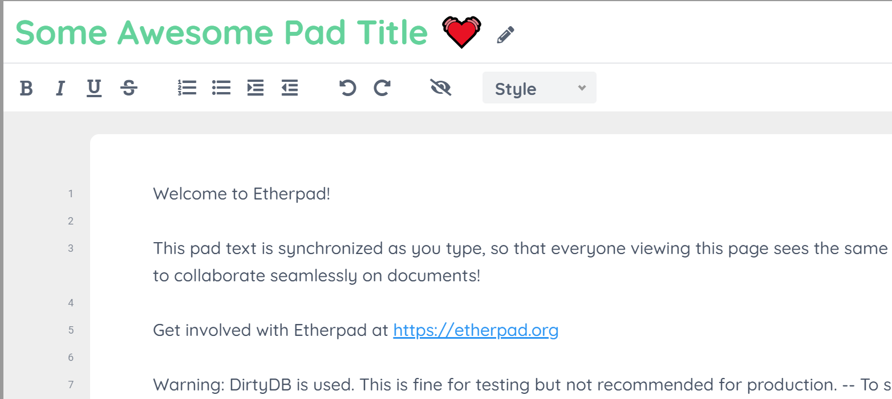

# ep_set_title_on_pad

[](https://github.com/ether/ep_set_title_on_pad/actions/workflows/test-and-release.yml) 
[](https://github.com/ether/ep_set_title_on_pad/actions/workflows/test-and-release.yml)

Adds a title field to pads that updates in real time and is used as the export filename.



## Install

```
pnpm run plugins i ep_set_title_on_pad
```

## License

Apache-2.0
